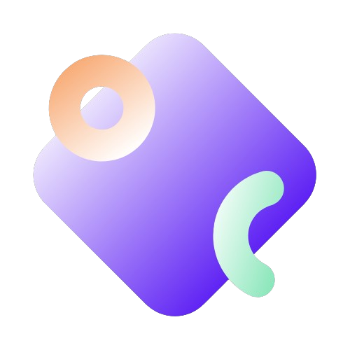

<div style="object-fit:cover;" >
  
</div>

**Youtube Link**: [Youtube link](https://youtu.be/VXjTE_w6Ank)<br>
**Website Link**: [Oplossing Connect](http://oplossing-connect.onrender.com/)

# Oplossing Solution

> Oplossing Connect is a comprehensive platform that bridges the gap between students and industry experts, particularly in the field of technology. This platform aims to streamline the process of connecting students with seasoned professionals who can provide insights and solutions to industry-standard problems. By bringing various domains under a single roof, Oplossing Connect simplifies the search for expertise and ensures that students receive the guidance they need to tackle complex challenges. The platform's user-friendly interface and robust set of features make it an invaluable resource for students at different stages of their academic and professional journeys.

## Features and Benefits

### 1. **Connecting with Experts**
   Oplossing Connect provides a seamless way for students to connect with experts across different domains of technology. Whether you're looking for advice on a coding project, insights into industry trends, or solutions to specific technical problems, the platform has a network of professionals who are ready to help.

### 2. **Domain Diversity**
   The platform covers a wide range of technology domains, including software development, data science, cybersecurity, artificial intelligence, and more. This diversity ensures that students can find expert help in any area they are interested in, making it easier to gain comprehensive knowledge and skills.

### 3. **Industry Standard Solutions**
   Oplossing Connect focuses on providing solutions that meet industry standards. This means that the advice and guidance offered on the platform are not only theoretically sound but also practically applicable in real-world scenarios. Students can be confident that the solutions they receive are relevant and up-to-date with current industry practices.

### 4. **Ease of Use**
   The platform is designed with user experience in mind. It is easy to navigate, and students can quickly find the resources they need. The interface is intuitive, and the process of connecting with experts is straightforward, reducing the time and effort required to get help.

### 5. **Resource Library**
   In addition to connecting with experts, Oplossing Connect also offers a rich library of resources, including tutorials, articles, and videos. These resources cover a wide range of topics and can be used to supplement the guidance received from experts, allowing students to learn at their own pace.

### 6. **Community Support**
   Oplossing Connect fosters a community of learners and professionals who can support each other. Students can participate in forums, ask questions, share experiences, and collaborate on projects. This community-driven approach enhances the learning experience and provides additional avenues for growth and development.

## Tech Stacks

Oplossing Connect is built using a combination of modern technologies that ensure reliability, scalability, and ease of use. Below is a detailed overview of the tech stacks used:

### 1. **[Flask](https://flask.palletsprojects.com/en/3.0.x/)**
   Flask is a lightweight web framework written in Python. It is used for building web applications and is known for its simplicity and flexibility. Oplossing Connect leverages Flask to handle the backend operations, including managing user requests, processing data, and serving the appropriate responses.

### 2. **Bootstrap**
   Bootstrap is a popular front-end framework used for developing responsive and mobile-first websites. The platform uses Bootstrap to ensure that the user interface is not only visually appealing but also adaptable to different screen sizes and devices.

### 3. **Jinja**
   Jinja is a templating engine for Python that is used in conjunction with Flask to generate dynamic web pages. By using Jinja, Oplossing Connect can create pages that are both interactive and customizable based on the user's needs.

### 4. **Dynamic Data Handling**
   The platform incorporates dynamic data handling to provide real-time updates and interactions. This allows for a more engaging user experience, as students can see the results of their actions immediately, whether they are posting a question, browsing resources, or connecting with an expert.

### 5. **[Render](https://render.com/)**
   Render is a cloud platform used for deploying web applications. Oplossing Connect is deployed on Render, which ensures that the platform is always available, scalable, and secure. By using Render, the team can focus on developing new features and improving the platform without worrying about server maintenance.

## Setup Environment

Setting up the environment to work on Oplossing Connect is straightforward. Below are the steps to get started:

### 1. **Clone the Repository**
   To begin, clone the repository to your local machine or a remote server. This will give you access to all the files and code needed to run the platform.
   ```bash
   $ git clone repo-link
   ```

### 2. **Understanding `app.py`**
   The `app.py` file is the core of the application. It contains the Python code that powers the platform, primarily using Flask for the backend. The file also includes routes and functions that handle user requests, interact with the database, and send data to the frontend.

### 3. **Structuring the Code with HTML**
   The platform's user interface is built using HTML files that are linked within the application. These files are organized in a way that makes the code easy to navigate and maintain. By structuring the code this way, it is easier to update the platform and add new features as needed.

### 4. **Styling with Bootstrap**
   Bootstrap is used to style the website, ensuring that it is both functional and aesthetically pleasing. The framework's components, such as buttons, forms, and navigation bars, are utilized to create a consistent and user-friendly design.

### 5. **Deploying on Render**
   After developing the application, it is deployed on Render. Render takes care of the deployment process, allowing the platform to be accessible online. The deployment process is automated, making it easy to push updates and new features.

### 6. **Debugging with Flask**
   Flask provides a built-in debugging tool that is enabled during development. This tool helps identify and fix issues in the code by providing detailed error messages and allowing developers to inspect the state of the application when an error occurs.
   ```python
   if __name__ == '__main__':
       app.run(host='0.0.0.0', debug=True)
   ```

## License

Oplossing Connect is released under the [MIT License](https://choosealicense.com/licenses/mit/). This license allows others to freely use, modify, and distribute the software, making it an ideal choice for open-source projects.

## Contributors

Oplossing Connect is a collaborative effort, and the project has benefited from the contributions of many developers. You can view the list of contributors on the project's GitHub page:
[](https://github.com/karthikarun063/Final-Project/graphs/contributors)

## Conclusion

Oplossing Connect is more than just a platform; it is a bridge between students and the industry. By offering access to expert knowledge, industry-standard solutions, and a supportive community, the platform empowers students to achieve their goals and succeed in their careers. Whether you're a student looking for guidance or a professional willing to share your expertise, Oplossing Connect has something valuable to offer.

